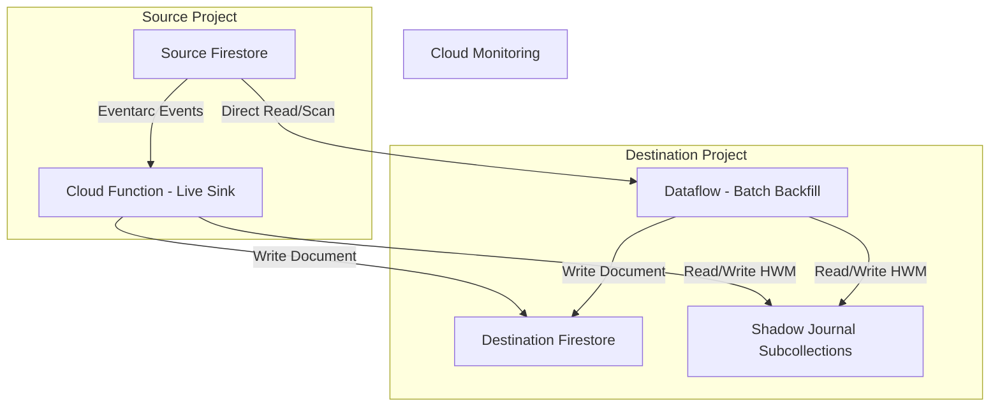
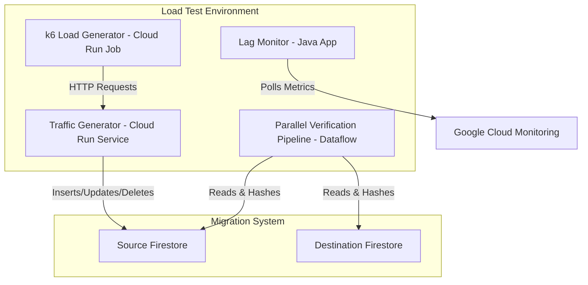

# Firestore Shadow-Journal Migration Architecture

This document details the architecture of the Firestore Migration tool, explaining how it achieves online migration without data loss or race conditions.

## System Architecture

The migration tool uses two concurrent processes to move data from the Source Firestore database to the Destination Firestore database:

1.  **Live Stream Sink (Cloud Function + Eventarc)**: Captures real-time writes from the Source database and applies them to the Destination.
2.  **Batch Backfill Sink (Dataflow)**: Scans the entire Source database in parallel and upserts documents into the Destination.

### System Diagram

---

## Data Correctness & Race Condition Prevention

The core challenge of concurrent batch and live migration is handling race conditions. For example, a document might be updated by the Live Sink *before* the Batch Backfill reaches it. If the Batch Backfill then writes the older version it read from the source, it would overwrite the newer data.

To solve this, we use the **Shadow-Journal Pattern** with a **High Water Mark (HWM)**.

### The Shadow-Journal Pattern

Every document in the destination database is associated with a shadow document in a specific subcollection (e.g., `_ShadowJournal/entry`). This shadow document stores the `hwm` (High Water Mark), which is the timestamp of the latest update applied to that document.

### The Sink Algorithm

For every incoming update (whether from the Live Sink or Batch Backfill):

1.  **Read HWM**: Read the current `hwm` from the document's `_ShadowJournal/entry`.
2.  **Compare**: Compare the `incoming_timestamp` (Event `commit_time` for Live, or Source `update_time` for Batch) with the `hwm`.
3.  **Conditional Write**:
    *   If `incoming_timestamp > hwm`:
        *   Apply the update to the destination document.
        *   Update the `hwm` in the shadow collection to `incoming_timestamp`.
    *   If `incoming_timestamp <= hwm`:
        *   **Ignore** the update. A newer version has already been written.

### Example Scenario (Preventing Race Condition)

1.  **Time T1**: Batch Backfill reads Document A from Source (Version 1).
2.  **Time T2**: User updates Document A in Source (Version 2).
3.  **Time T3**: Eventarc triggers Live Sink for Version 2. Live Sink writes Version 2 to Destination and sets HWM = T2.
4.  **Time T4**: Batch Backfill attempts to write Version 1 (read at T1) to Destination.
5.  **Resolution**: The algorithm reads HWM (T2). Since T1 <= T2, the Batch write is ignored. Version 2 remains in the destination. Data correctness is guaranteed.

### Deletions and Tombstones

When a document is deleted in the source, the Live Sink deletes the document in the destination but **keeps** the `_ShadowJournal/entry` with the deletion timestamp. This acts as a "tombstone", preventing an older Batch Backfill task from accidentally re-creating a document that was intentionally deleted.

---

## Assumptions About Data Correctness

The correctness guarantees of this system rely on the following assumptions:

1.  **Monotonic Timestamps**: We assume that timestamps provided by Firestore (update time) and Eventarc (commit time) are monotonically increasing for a given document and reliably reflect the order of operations.
2.  **Eventarc Delivery**: We assume Eventarc delivers events for all writes. If an event is lost, the live stream will miss that update. (Cloud Functions retry delivery on failure, mitigating this).
3.  **Firestore Atomic Operations**: We assume that the read-modify-write operations on the document and its shadow journal are performed transactionally or at least that the HWM update is atomic relative to document writes to prevent concurrent execution races within the same function instance.

---

## Load Test Framework

To validate the architecture under scale, a load test framework was developed to generate traffic, monitor lag, and verify data integrity.

### Load Test Infrastructure Diagram

### Components

1.  **k6 Load Generator**: A Cloud Run Job running k6 scripts to generate a constant request rate.
2.  **Traffic Generator**: A Cloud Run service that receives requests from k6 and translates them into actual Firestore operations (inserts, updates, deletes) on the Source database.
3.  **Lag Monitor**: A utility that polls Cloud Monitoring metrics to measure propagation delay between source and destination.
4.  **Parallel Verification Pipeline**: A Dataflow job that runs at the end of the test. It reads all documents from both source and destination, computes sharded hashes, and compares them to guarantee 100% data integrity.
